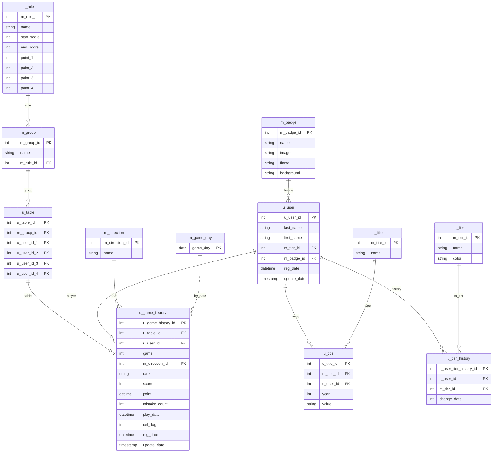

# 開発環境
* バックエンド：Laravel 12（API開発、認証、バリデーション）
* フロントエンド：Next.js（SPA構成、UI実装、API連携）
* データベース：MySQL（設計、集計処理）
* インフラ/環境：Docker（ローカル環境）、Xserver（本番デプロイ）
---

# 麻雀成績管理｜DB 設計書

## 全体像

* **命名規則**: マスタは `m_*`、ユーザー・利用系は `u_*`、Laravel 標準は `users/sessions/...`。
* **主な機能**: 卓（テーブル）編成、対局履歴、年間タイトル、階級（Tier）・称号（Badge）管理、対局日マスタ、ルール（ウマ/返し）設定。
* **リレーション（論理）**

  * ルール(`m_rule`) ← グループ(`m_group`) ← 卓(`u_table`) ← 対局履歴(`u_game_history`)
  * ユーザー(`u_user`) ← 対局履歴(`u_game_history`)
  * 方位(`m_direction`) ← 対局履歴(`u_game_history`)
  * ユーザー(`u_user`) ← タイトル所持(`u_title`) → タイトル種別(`m_title`)
  * ユーザー(`u_user`) ← 階級履歴(`u_tier_history`) → 階級(`m_tier`)
  * ユーザー(`u_user`) → 称号(`m_badge`)
  * 対局日(`m_game_day`) は集計/バリデーション用（履歴には `play_date` で実対局日時を保存）

> 現行 DDL は外部キー制約を張っていません（アプリ側で整合性を担保）。本書では**論理的 FK**を明示します。

---

## ER 図（Mermaid）



---

## テーブル定義（詳細）

### 1) m_rule — ルール

| 列           | 型                    | Null | 既定値       | 説明                 |
| ----------- | -------------------- | ---- | --------- | ------------------ |
| m_rule_id   | TINYINT(3) UNSIGNED  | NO   | -         | PK                 |
| name        | VARCHAR(64)          | NO   | 'UNKNOWN' | ルール名（例: Mリーグ/最高位戦） |
| start_score | SMALLINT(5) UNSIGNED | NO   | 0         | 配原点（配分の起点点数）       |
| end_score   | SMALLINT(5) UNSIGNED | NO   | 0         | 返し点（精算の基準点）        |
| point_1..4  | TINYINT(3)           | NO   | 0         | 順位ウマ（1〜4位）         |

**ポイント計算**: `((score - end_score) / 1000) + UMA(rank)`。例: スコア 91,000・返し 30,000・1位 UMA=+50 → 61.0 + 50 = **111.0**。

### 2) m_group — グループ（卓の種別）

| 列          | 型                   | Null | 既定値       | 説明             |
| ---------- | ------------------- | ---- | --------- | -------------- |
| m_group_id | TINYINT(3) UNSIGNED | NO   | -         | PK             |
| name       | VARCHAR(64)         | NO   | 'UNKNOWN' | グループ名（A卓・B卓など） |
| m_rule_id  | TINYINT(3) UNSIGNED | NO   | 0         | 適用ルール FK       |

### 3) u_table — 卓（対局メンバー）

| 列              | 型                   | Null | 既定値 | 説明                    |
| -------------- | ------------------- | ---- | --- | --------------------- |
| u_table_id     | TINYINT(3) UNSIGNED | NO   | -   | PK                    |
| m_group_id     | TINYINT(3) UNSIGNED | NO   | 0   | グループ FK（→ m_group）    |
| u_user_id_1..4 | TINYINT(3) UNSIGNED | NO   | 0   | その卓の参加者 1〜4（→ u_user） |

> 将来の拡張として、可変人数や観戦等を視野に **`u_table_member`** の正規化を推奨（`u_table_id`×`u_user_id`×`seat`）。

### 4) u_game_history — 対局履歴

| 列                 | 型                    | Null | 既定値               | 説明                                  |
| ----------------- | -------------------- | ---- | ----------------- | ----------------------------------- |
| u_game_history_id | SMALLINT(5) UNSIGNED | NO   | -                 | PK                                  |
| u_table_id        | TINYINT(3) UNSIGNED  | NO   | 0                 | 卓 FK（→ u_table）                     |
| u_user_id         | TINYINT(3) UNSIGNED  | NO   | 0                 | ユーザー FK（→ u_user）                   |
| game              | TINYINT(3) UNSIGNED  | NO   | 0                 | 同一卓での試合番号（1,2,3…）                   |
| m_direction_id    | INT(3) UNSIGNED      | NO   | 0                 | 方位（→ m_direction: 東南西北）             |
| rank              | VARCHAR(32)          | NO   | 'UNKNOWN'         | 順位。`"1"/"2"/"3"/"4"/同着例 `"2=2"` を許容 |
| score             | INT(6)               | NO   | 0                 | 素点（終局時スコア）                          |
| point             | DECIMAL(5,1)         | NO   | 0.0               | 精算ポイント（返し+ウマ適用後）                    |
| mistake_count     | TINYINT(3) UNSIGNED  | NO   | 0                 | チョンボ回数                              |
| play_date         | DATETIME             | NO   | '1000-01-01'      | 対局日時                                |
| del_flag          | TINYINT(3) UNSIGNED  | NO   | 0                 | ソフトデリート用フラグ                         |
| reg_date          | DATETIME             | NO   | '1000-01-01'      | 登録日時                                |
| update_date       | TIMESTAMP            | NO   | CURRENT_TIMESTAMP | 更新日時（ON UPDATE）                     |

**インデックス**: `PRIMARY KEY (u_game_history_id)`, `KEY idx_game_user (u_user_id)`, `KEY idx_game_play_date (play_date)`, `KEY idx_game_no (game)`

### 5) u_user — ユーザー

| 列           | 型                   | Null | 既定値               | 説明                           |
| ----------- | ------------------- | ---- | ----------------- | ---------------------------- |
| u_user_id   | TINYINT(3) UNSIGNED | NO   | -                 | PK                           |
| last_name   | VARCHAR(64)         | NO   | 'UNKNOWN'         | 姓                            |
| first_name  | VARCHAR(64)         | NO   | 'UNKONWN'         | 名（※既定値に綴り誤りあり。`UNKNOWN` を推奨） |
| m_tier_id   | TINYINT(3) UNSIGNED | NO   | 0                 | 現在の階級（→ m_tier）              |
| m_badge_id  | TINYINT(3) UNSIGNED | NO   | 0                 | 現在の称号（→ m_badge）             |
| reg_date    | DATETIME            | NO   | CURRENT_TIMESTAMP | 登録日時                         |
| update_date | TIMESTAMP           | NO   | CURRENT_TIMESTAMP | 更新日時（ON UPDATE）              |

### 6) u_title — ユーザーの年間タイトル

| 列          | 型                    | Null | 既定値 | 説明                                  |
| ---------- | -------------------- | ---- | --- | ----------------------------------- |
| u_title_id | SMALLINT(5) UNSIGNED | NO   | -   | PK                                  |
| m_title_id | TINYINT(3) UNSIGNED  | NO   | 0   | タイトル種別（→ m_title）                   |
| u_user_id  | TINYINT(3) UNSIGNED  | NO   | 0   | ユーザー（→ u_user）                      |
| year       | YEAR(4)              | NO   | -   | 受賞年                                 |
| value      | VARCHAR(255)         | NO   | -   | 受賞値（例: 最高点数=94300, 4着回避率=82.42% など） |

### 7) u_tier_history — ユーザー階級の変更履歴

| 列                      | 型                   | Null | 既定値 | 説明                |
| ---------------------- | ------------------- | ---- | --- | ----------------- |
| u_user_tier_history_id | INT(10) UNSIGNED    | NO   | -   | PK                |
| u_user_id              | TINYINT(3) UNSIGNED | NO   | -   | ユーザー（→ u_user）    |
| m_tier_id              | TINYINT(3) UNSIGNED | NO   | -   | 適用された階級（→ m_tier） |
| change_date            | YEAR(4)             | NO   | -   | 変更年               |

### 8) m_title — タイトル種別

| 列          | 型            | Null | 既定値 | 説明                        |
| ---------- | ------------ | ---- | --- | ------------------------- |
| m_title_id | TINYINT(3)   | NO   | -   | PK                        |
| name       | VARCHAR(255) | NO   | -   | タイトル名（MVP / 最高点数 / 4着回避率） |

### 9) m_tier — 階級

| 列         | 型                   | Null | 既定値 | 説明             |
| --------- | ------------------- | ---- | --- | -------------- |
| m_tier_id | TINYINT(3) UNSIGNED | NO   | -   | PK             |
| name      | VARCHAR(32)         | NO   | -   | 階級名（S/A/B/C/D） |
| color     | VARCHAR(32)         | NO   | -   | 表示色コード（HEX など） |

### 10) m_badge — 称号

| 列          | 型            | Null | 既定値 | 説明       |
| ---------- | ------------ | ---- | --- | -------- |
| m_badge_id | TINYINT(3)   | NO   | -   | PK       |
| name       | VARCHAR(64)  | NO   | -   | 称号名      |
| image      | VARCHAR(255) | NO   | -   | 画像ファイル名  |
| flame      | VARCHAR(255) | NO   | -   | 枠（未使用可）  |
| background | VARCHAR(255) | NO   | -   | 背景（未使用可） |

### 11) m_direction — 自家（東南西北）

| 列              | 型                   | Null | 既定値 | 説明                        |
| -------------- | ------------------- | ---- | --- | ------------------------- |
| m_direction_id | TINYINT(3) UNSIGNED | NO   | -   | PK（1:東 / 2:南 / 3:西 / 4:北） |
| name           | VARCHAR(64)         | NO   | -   | 表示名                       |

### 12) m_game_day — 対局日

| 列        | 型    | Null | 既定値 | 説明        |
| -------- | ---- | ---- | --- | --------- |
| game_day | DATE | NO   | -   | 対局日（一意制約） |

### 13) m_setting — システム設定

| 列            | 型                    | Null | 既定値 | 説明            |
| ------------ | -------------------- | ---- | --- | ------------- |
| m_setting_id | TINYINT(3) UNSIGNED  | NO   | -   | PK            |
| name         | VARCHAR(255)         | NO   | -   | 設定名（例: 点数非表示） |
| value        | SMALLINT(5) UNSIGNED | NO   | 0   | 値             |

### 14) Laravel 標準テーブル（抜粋）

* `users`（アプリログイン用）
* `sessions`（セッション）
* `password_reset_tokens` / `cache` / `cache_locks` / `jobs` / `job_batches` / `failed_jobs` / `migrations`

---

## インデックス/Auto Increment（要約）

* 主キー: 各テーブルの ID 列に設定。
* `u_game_history` に複数の検索系インデックス（user / play_date / game）。
* `m_game_day.game_day` は一意。
* Auto Increment は `m_*`/`u_*`/Laravel 標準の ID に設定済み。

---

## ビジネスルール

* **ポイント算出**は `m_rule` の `end_score` と `point_1..4` を使用。
* **同着**は `rank` に `"2=2"` のような文字列表現で保存（1位/2位/3位/4位の数値も許容）。
* **削除**は `del_flag` による論理削除（履歴保全）。
* **称号/階級**は `u_user` の現在値と履歴テーブル（`u_tier_history`）を併用。

---

## サンプルクエリ

**1) 月間ランキング（ポイント合計）**

```sql
SELECT u.u_user_id, CONCAT(u.last_name, ' ', u.first_name) AS name,
       SUM(g.point) AS total_point
FROM u_game_history g
JOIN u_user u ON u.u_user_id = g.u_user_id
WHERE g.play_date >= '2025-09-01' AND g.play_date < '2025-10-01'
GROUP BY u.u_user_id
ORDER BY total_point DESC;
```

**2) 年間タイトル（最高得点）更新候補**

```sql
SELECT g.u_user_id, MAX(g.score) AS max_score
FROM u_game_history g
WHERE YEAR(g.play_date) = 2025
GROUP BY g.u_user_id
ORDER BY max_score DESC
LIMIT 1;
```

**3) ユーザーの階級推移**

```sql
SELECT y.change_date AS year, t.name AS tier
FROM u_tier_history y
JOIN m_tier t ON t.m_tier_id = y.m_tier_id
WHERE y.u_user_id = 1
ORDER BY y.change_date;
```

---
